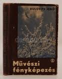
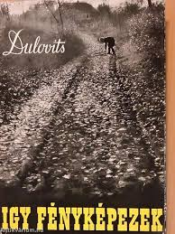
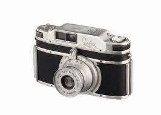

Fotóművészet
============

**Készítette:** Félegyházi Panka

**Konzulens:** Félegyházi Gábor József (apukám)

**Készült:** 2016-17

TARTALOM:
----------------

- Bevezetés
- Egy híres fényképész bemutatása (Dulovits Jenő)
- Dulovits Jenő fotói
- Az első tükörreflexes gép
- Portré fotózás
- Fótózás elmélet és technika
- Fotóim (rövid leírás)

BEVEZETÉS
---------
*Miért választottam ezt a témát?*

Mert szeretem a fotózást. Mert nekem fontos hogy megörökitsek egy-egy pillanatot.

*Mi is a mestermukám?*

Egy kis izzelítő a fotózás különböző területeiből és eszközeiből.

Egy híres fényképész bemutatása:
--------------------------------

**Dulovits Jenő**

Mért pont ő?

Mert ő anyai ágon rokonom. És nem utorsó sorban egy nagyon híres magyar fotóművész volt. Ő a példa képem.

> " A Fény szerelmese vagyok. Hiszem és vallom, hogy a fénykép legnagyobb erénye csakis a Fény kifejezése, hangsúlyozása lehet. Bizonyára mások is vallják ezt, mert sokat írnak és szavalnak a Fény fontos szerepéről, de nem mutatják meg a hozzá vezető utat, mivel nem ismerik. Én rátaláltam erre az útra és azt őszintén, becsületesen meg is mutatom. Add a kezed, kedves Olvasó, tarts velem és elvezetlek a Fény, meg a vele kifejezhető Szépség birodalmába. Azt akarom, hogy Te is a Fény szerelmese légy. Mindent elkövetek ennek az érdekében, bár a könyv méretei, az anyagi korlátok eléggé megkötik a kezeimet. Mindezek ellenére is bízom abban, hogy sikerül majd elérnem a célomat."   
> **Dulovits Jenő:** *Művészi fényképezés. Stephaneum Nyomda, 1942. 6. oldal*

- **Születtet:** 1903 Június 22. Ipolyság
- **Elhunyt:** 1972 Julius 24. Budapest
-	**Állampolgársága:** Magyar
-	**Nemzetisége:** Magyar
-	**Foglalkozása:** matematikus, feltaláló, fényképész és tanár.

### Élete

 A pesti egyetemen matematika-fizika szakos tanári diplomát szerzett, ezután középiskolai matektanár, a második világháború után a Gamma Művekben konstruktőrként dolgozott. Az 1920-as évek közepén kezdett el intenzíven a fényképezéssel foglalkozni.

**Fontos évszámok:**

- 1903 június 22: születésének ideje
- 1920-as évek: ekkor kezdet intenzíven a fényképezéssel foglalkozni.
- 1931-től 1958-ig: 13  szabadalmat jelentett be, egy részük a fénykép éles rajzát feloldó, lággyá tevő előtétlencsére, míg a többi egy gyakorló fényképész által elképzelt, ideálisan használható fényképezőgépre vonatkozott.
- 1943-ban szabadalmaztatta a fototechnika történetében korszakos jelentőségű Duflex-et, a világon az első tükörreflexes, kisfilmes és beugrórekeszes objektívvel működő fényképezőgépet, és ő volt Szőts István Kádár Kata című filmjének operatőre, s több szakkönyve jelent meg.

Két könyve még ma is kapható:

- Művészi fényképezés   

- Így fényképezek   

Magyar nyelven kívül még németül is jelentetk meg könyvei.

Az első tükörreflexes gép
-------------------------

**Feltalálta:** Dulovits Jenő
**Neve:** DUFLEX

A Duflex a szinte egyáltalán nem létező magyar fényképezőgép-gyártásból bukkan elő, technikailag maga mögé utasítva  németeket akik ezen a téren az eggyi legügyessebbek. A Szovjetuni teljesen lemaradt. A japánok(Canon, Asahi - Pentax, Miranda, Nikon, Olympus és még sok másik) még csak álmodoznak, szövögetik világmegváltó terveiket, részben éppen Dulovits Jenő találmányaira alapozva.”
 Nem tudni, pontosan hány Duflex készült a Gammában. Működőképes és közepes esztétikai állapotú gép nem marad a milliós határ alatt ma az árveréseken. A különös műgonddal összeszerelt prototípust a Gamma Optikai Művek kötelességszerűen átadta a Műszaki Múzeumnak. Az összes többi magyar fényképezőgép társaságában itt volt a 001-es Duflex kiállítva a kilencvenes években, mígnem a múzeumba betörtek, és a teljes magyar kollekciót elrabolták. Felmerült a Műszaki Múzeum részéről a visszavásárlás gondolata is, de még a négymillió ft sem volt elég  az új tulajdonosnak.

Dulovits Jenő fotói
-------------------

Nem csak a gyönyörű fiatal nőket fotózta, hanem egyaránt az idősebbeket is.

Ez egy nagyon szép és tartalmas kép Dulovits Jenő gyűjteményéből. Nagyon sok érdekes és a korhoz képest nagyon fejlett tehnikával rendelkezik. Nagyon érdekelte az emberi test felépítése (leginkább a női test de ez érthető hisz férfi) ezért csomó olyan képe van ahol a modell mesztelen. Kiváló megfigyelő képessége van.

Ez pedig egy kicsit anatómiai. Ez az egyik legfontosabb területe a fotó művészetnek. Nincs művészettanulás az emberi testfelépítésének megtanulása nélkül.

Gyönyörű portrékat is készített.

Fótózás elmélet és technika:
----------------------------

### Az objektívek:

**Normál látószögű objektív:** a normál látószögű objektív látószöge hasonló az ember szemének a látószögéhez. Gyújtótávolsága nagyjából megegyezik a film vagy Szenzor képátlójával. A kis filmes fényképezőgépen ez nagyjából 50 mm. Az ez alatti gyújtótávolságú objektíveket **nagylátószögű objektív**-nek nevezzük. Az 50 mm fölöttieket pedig **teleobjektív**-nek nevezzük. A nagylátószögű objektívek a hátteret és a közelben lévő dolgokat aránytalanul nagyobbnak mutatják ezért nem szoktuk használni portréfotózáshoz mert eltorzítják az arcot. Működésük szerint kétféle objektívet ismerünk a zoom objektívet a és a fix objektívet, utóbbi nagyobb fényerejű és élesebb rajzolatú, kisebb tele gyujtótávolságú falyták (50mm - 85mm) kifjezetten alkalmas a portré fotózásra.

A **zoom objektívnek** egy bizonyos tartományon belül változtatható a gyújtótávolsága. A zoom objektívek használat közben praktikusak. A fix objektív gyújtótávolsága nem változtatható (ezért nevezzük fix objektív). 

**Az én felszerelésem:** A gépem egy Nikon digitális tükör reflexes D90 -es.A kedvenc objektíven az 50 mm-es gyújtó távolságú mert kicsi de nagy fényerejű, könnyű és portréfotózásra nagyon alkalmas. Szoktam még 18-55 mm-es zoom objektívvel is fényképezni.A zoom objekívvet tájképekekhez szoktam használni és utazásnál kültéren,mert igaz hogy kisebb a fényereje de mivel kezdőknek való ezért könnyű és van benne autómata rázkódáscsökkentés.

### Mi az a fényképszerűség?

A fényképezőgép objektívje objektíven azaz valóságnak megfelelően látja a világot, a fényképezésnek tehát a valós ábrázolás az alapja (Ellentétben például az inpresszionista festésettel). A fényképszerűség pedig nem más mint az ideális ábrázolásnak a fényképezésnek a sajátos eszközeivel való megközelítése. Fényképezés eredménye A fénykép tehát a fények és az árnyékok megörőkítése.

### A térhatás:

Mivel a fénykép is mint a festmény kétdimenziós ezért a térhatás tökéletes ábrázolása a fényképezésnél is kihívás. Igazából erre több lehetőség is van (a térhatás elérésére). Egyik eszköze a kis mélységélesség. Ez az én kedvenc technikám, mert ezzel az előtér, a téma és a háttér elkülöníthető. Ha jól alkalmazzák akkor a téma éles a háttér és az előtér pedig nem. Többek között ennek a hatásnak az eléréséhez van szükség a nagy fényerejü fix objektívre. Javítja a térhatást az ellenfény alkalmazása vagy a levegőben terjengő por,füst, köd egyéb más ami befolyásolja a levegő átlátszóságát. A térhatás érzékeltetésére használhatjuk a képen elhelyezkedő vonalakat is, fontos hogy a képen hova helyezzük el a horizontot (ez tágíthatja vagy szűkítheti a teret) és például a kép sarkából a kép belseje felé haladó vonalak erősítik a térhatást.

### A vonalvezetés:

Nagyon fontos hogy a képen elhelyezkedő egyenes vonalak hogyan jelennek meg. Az egyenes vonalak lehetőleg ne legyenek párhuzamosak a kép széleivel. A párhuzamosság unalmas lehet. Portré fotózásnál ezért szoktam különleges sögeket alkalmazni. Például ezért szoktem legugolni. A távolba mutató egyenesek találkozási pontja az úgynevezett végtelen pont ne legyen a kép szélén. A görbe vonalak a kép téglalap vagy négyzet alakú kivágásába sokkal jobban hatnak. A kép különböző szélső pontjaiból induló vonalak alkalmasak lehetnek arra hogy a szemlélő tekintetét a témára vezessék.

### A tér elosztás vagy a terület elosztása:

Fényképezéskor fontos a fénykép területének azaz a képtérnek az elosztása. Ezt szoták komponálásának vagy a kép kompozíciójának is nevezni. A kép széleivel vigyázni kell, nehogy kimaradjon,levágjunk valamit. Ezért kell megfelelő teret hagyni a széleken, de fel is lehet rugni ezeket a szabályokat és direkt úgy nevezett szűkreszabott képet készíteni. Ezzel a megoldással ki lehet emelni a portré alany arckifejezését, szemeit. Javasolni szokták, hogy kerülendő a téma középrehelyezése, mert unalmassá teheti a képet, de kivételt lehet tenni például szűk mélységélességű protré esetén, mert így ki lehet használni, hogy az objektívek a kép közepén élesebben rajzolnak mint a széleken. Lehet alkalmazni az úgynevezett harmadolást is, amikor két függőleges és két vízszíntes vonallal (ezek a vonalak segítségül látszanak a gépem keresőjében is), ha ezek metszés pontjára, a harmadoló pontokra komponáljuk a témát az érdekesebbé, dinamikusabbá teszi a képet.

FOTÓIM
------

Köszönetnyilvánítás
-------------------

Köszönöm mindenkinek aki segített a mestermunkám készítése során: 
Az osztályfőnökeimnek:Veroninak és Icának, Balázsnak a vizuális tanáromnak.
A konzulensemnek: Félegyházi Gábornak ( az apukámnak) és az anyukámnak. Valamint a képeimen szereplő portréalanyaimnak, az osztálytársaimnak és barátamimnak, hogy hozzájárulta hogy publikálhassam a róluk készített képeimet.
